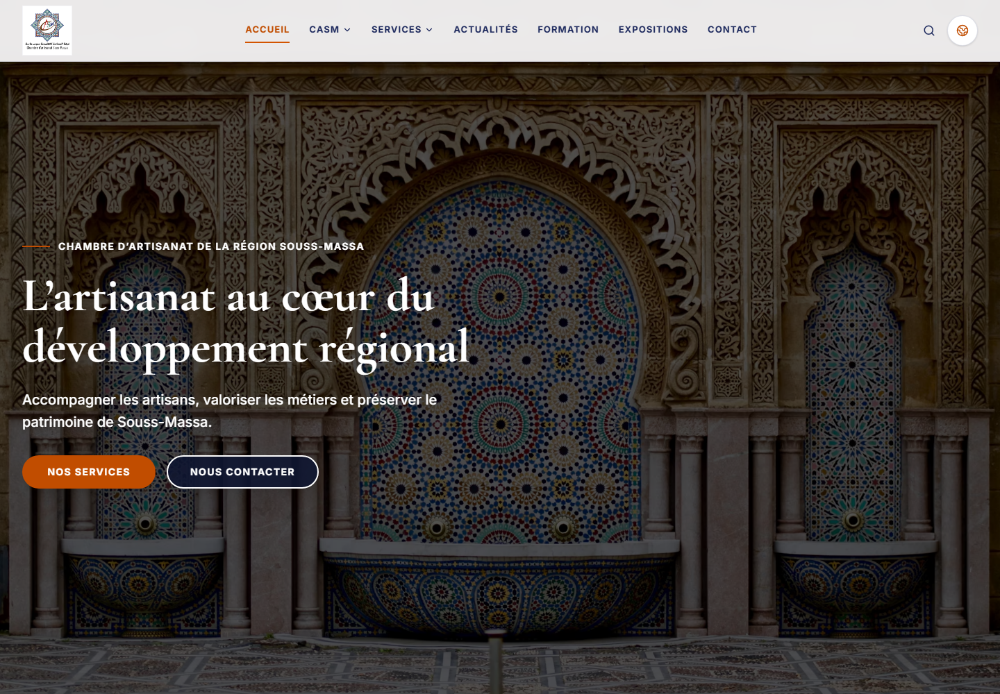
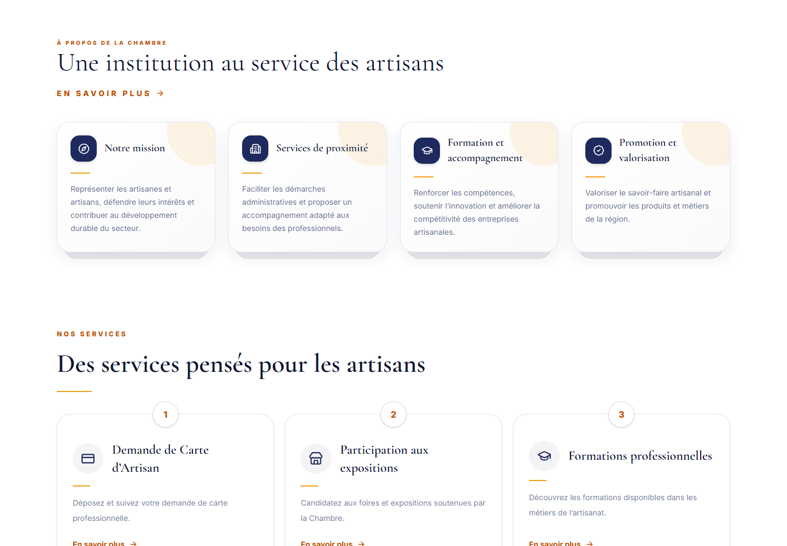
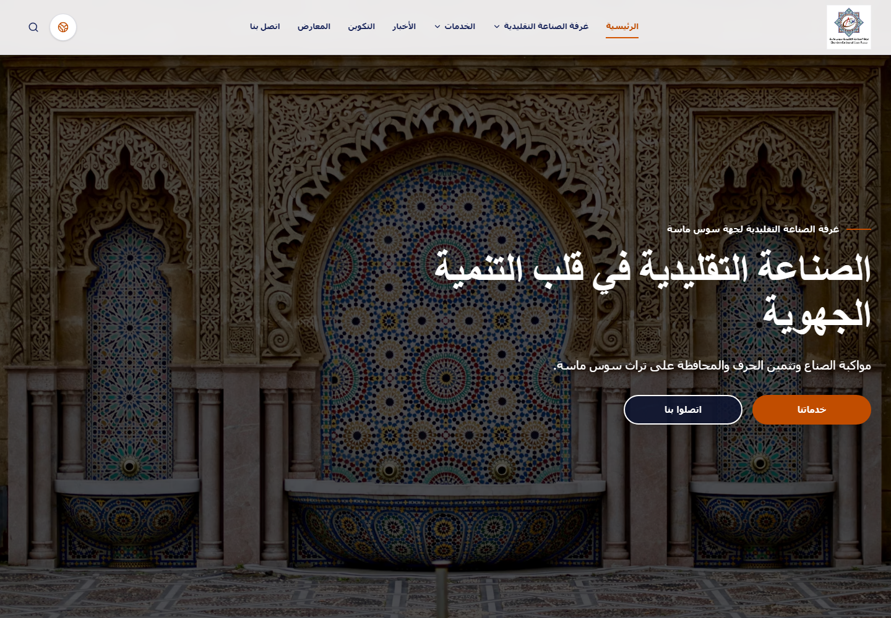
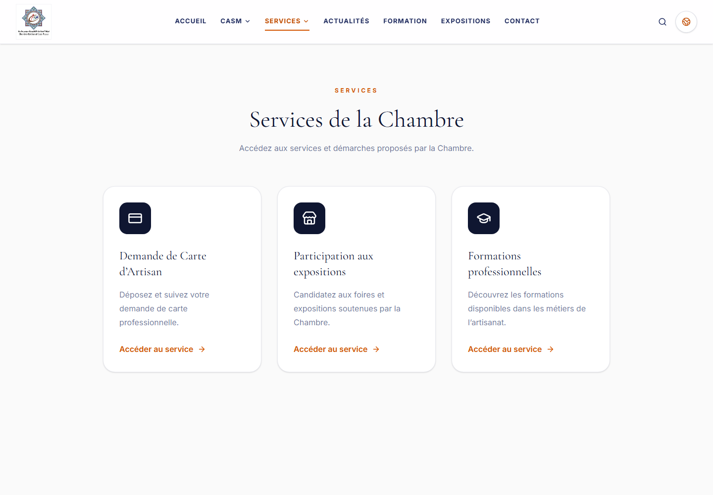
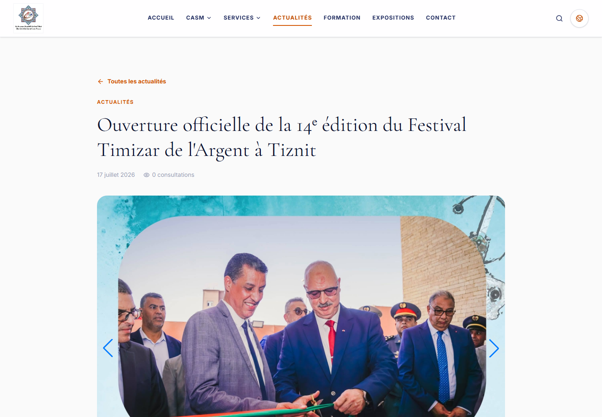
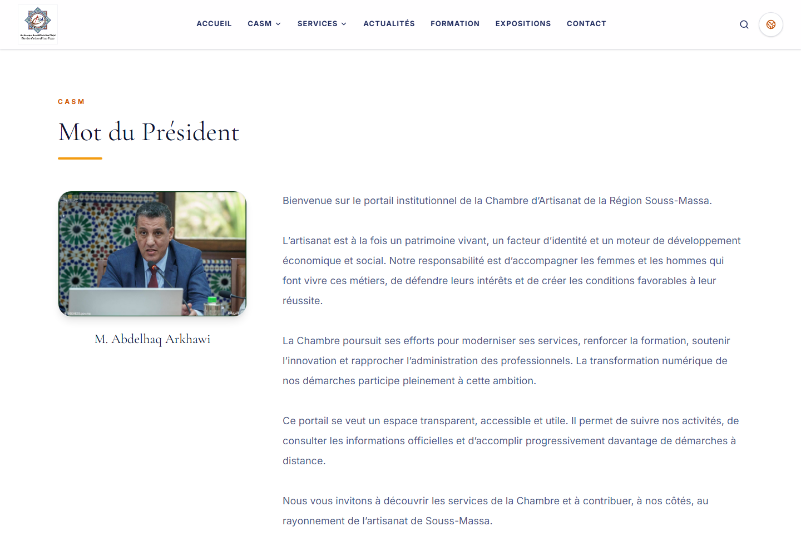

# CASM — Public Digital Platform Showcase

Public showcase for the digital platform of the **Chambre d’Artisanat de la Région Souss-Massa (CASM)**.

> This repository is a visual case study only. Production source code, CMS code, APIs, databases, infrastructure configuration, credentials, and user submissions are intentionally excluded.

## Project overview

CASM is a trilingual institutional platform designed to make the Chamber’s information and services easier to discover and use. It combines a responsive public website with a secure content-management environment for news, institutional pages, services, professional training, exhibitions, online applications, and public contact channels.

The public experience remains useful even when the content API is temporarily unavailable, while published CMS content can take priority whenever it is available.

## Main features

- Responsive institutional website for desktop, tablet, and mobile.
- French, Arabic, and English content with automatic LTR/RTL presentation.
- Public presentation of CASM, its missions, services, news, training, and exhibitions.
- Multilingual news listing, detail pages, galleries, search, and pagination.
- Service and activity registration workflows with secure document uploads.
- Dynamic multilingual forms with conditional fields and validation.
- CMS-managed pages, navigation, branding, settings, news, services, and activities.
- French and Arabic administration interface with role-based access control.
- Submission management, status history, assignment, notes, exports, and document downloads.
- Search-engine metadata, social sharing metadata, canonical URLs, hreflang, and structured data.

## Tech stack

| Layer | Technologies |
| --- | --- |
| Frontend | React 19, Vite 6, Tailwind CSS 4, React Router, Axios, Swiper, Lucide React |
| Backend | Laravel 13, PHP 8.3+, Laravel Sanctum, Eloquent ORM, REST API |
| Data | SQLite for development, MySQL for production |
| Documents | Secure private uploads, PDF generation, Arabic document support |
| Quality | ESLint, PHPUnit, Laravel Pint, Composer Audit, Vite production builds |

## Technical highlights

- API-first separation between the React public interface and Laravel backend.
- Route-level code splitting for a faster initial experience.
- Responsive AVIF hero imagery with optimized source sets.
- CMS-independent fallback content for resilient public rendering.
- Versioned dynamic-form schemas that preserve historical submissions.
- Secure uploads with MIME/content validation, private storage, and randomized filenames.
- Encrypted submission data with privacy-conscious administrative search.
- Sanctum authentication, Laravel policies, granular permissions, throttling, and signed downloads.
- Accessible navigation, visible focus states, semantic labels, and RTL-aware layouts.
- Multilingual SEO using canonical links, hreflang, Open Graph, and Schema.org data.

## Challenges and solutions

| Challenge | Solution |
| --- | --- |
| Delivering one coherent experience in French, Arabic, and English | Localized content fields and a shared language context update copy, document language, text direction, and navigation consistently. |
| Supporting Arabic without compromising the original visual identity | Direction-aware layouts and controls provide native RTL behavior while preserving CASM typography, spacing, and branding. |
| Keeping public pages available during CMS or API interruptions | Carefully maintained built-in public content is used only when no published API content is available. |
| Evolving administrative forms without breaking older records | Versioned form definitions keep each submission linked to the exact schema used when it was created. |
| Protecting applicant data and uploaded documents | Strong validation, encryption, private file storage, permission checks, and signed administrative downloads. |
| Managing publication and registration windows | Server-side status rules determine visibility and registration availability from publication and scheduling dates. |

## Screenshots

### Homepage and institutional identity

### Chamber missions and services

### Arabic RTL experience

### Public services

### News and media gallery

### President’s message

## Live demo

The production deployment is private. A live demonstration can be made available on request.

Showcase repository: [github.com/Zayneb-ob1/CASM-SHOWCASE](https://github.com/Zayneb-ob1/CASM-SHOWCASE)

## Credits

- **Client:** Chambre d’Artisanat de la Région Souss-Massa
- **Design and development:** zayneb ouabella
- **Showcase repository:** [Zayneb-ob1](https://github.com/Zayneb-ob1)

CASM names, logos, photographs, and editorial content remain the property of their respective owners and are reproduced here solely to present the delivered work. No reuse rights are granted.

Screenshots contain only publicly accessible institutional content. No administrator, applicant, credential, or private client data is included.
